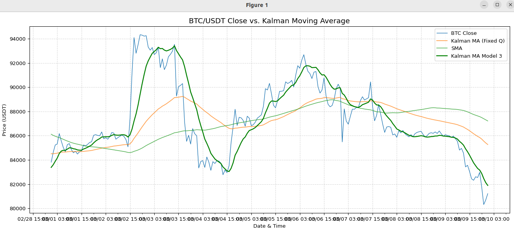

# Kalman Filter Moving Average 分析結果

## ① グラフ結果の概要

今回比較したカルマンフィルターは、以下の2種類です。

**Kalman MA（固定Q）：**
価格を単純な1次元カルマンフィルターで平滑化する方法で、一定のプロセスノイズ（Q）を設定します。ノイズを抑える効果はありますが、価格への反応がやや遅れる特徴があります。

**Kalman MAモデル3：**
短期と長期の二つの状態（要素）を持つ拡張型カルマンフィルターです。これにより、価格変化への高い追従性を持つことができます。

グラフを見ると、Kalman MAモデル3（緑線）は価格（青線）の大きな変動に対し、Kalman MA（固定Q・オレンジ線）やSMA（薄緑線）よりも素早く追従しています。



## ② モデル3（緑線）の強み

Kalman MAモデル3の最大の特徴は「**追従性の高さ**」です。3月2日深夜から3月3日にかけての価格急騰や、3月4日〜5日の急落にも、ほぼリアルタイムに近い速度で対応しています。特に、価格の転換ポイントを素早くキャッチし、トレンド変化を迅速に捉える能力に優れています。

## ③ 滑らかさとノイズのバランス

Kalman MAモデル3は追従性を高めるため、多少のノイズ（小さな上下変動）が発生しています。対して、SMAは非常に滑らかですがトレンドへの反応が大幅に遅れます。Kalman MA（固定Q）は、その中間でほどよい滑らかさを持ちますが、価格変動への反応速度ではモデル3に劣ります。

## ④ 課題（オーバーシュート）

追従性が高いため、Kalman MAモデル3は価格が急激に動いた際に、やや「**行き過ぎ**」（オーバーシュート）る傾向があります。例えば、3月2日のピークや3月9日の下落局面で実際の価格を少し超えてしまっています。この動きは短期的な強い価格変動に敏感に反応する設定が影響しています。

## ⑤ 改善のためのポイント

このオーバーシュートを抑えるには以下の調整が効果的です。

### 追従性を少し落として平滑性を上げる：
プロセスノイズパラメータ（`q_params`）をやや小さく調整すると、ノイズが減り、安定性が増しますが、反応が若干遅れます。

```python
# より安定的な設定例
kalman_ma_model3(prices, q_params=(0.15, 0.08))  # デフォルト: (0.20, 0.10)
```

### 短期と長期のバランス調整：
短期と長期の比率を調整し、長期成分をやや強めることで、極端な値動きによるオーバーシュートを抑制できます。

```python
# 長期成分を強める設定例
kalman_ma_model3(prices, h_params=(1.2, 1.0))  # デフォルト: (1.5, 1.0)
```

### 横ばい相場での細かな動きを抑える：
ATRに基づく動的スケール係数（`beta`）を下げることで、低ボラティリティの時に細かな上下動を抑えることができます。

```python
# より安定的な設定例
kalman_ma_model3(prices, atr=atr_values, beta=0.5)  # デフォルト: 1.0
```

## ⑥ 推奨用途

### 短期トレード
Kalman MAモデル3は特に**短期トレード（数時間〜1日程度）**に向いています。価格変動を迅速に捉えて素早いエントリーや利確が可能です。

### 中期トレード
中期（数日〜数週間）以上のトレードでは、固定QのKalman MAやSMAなど、安定性の高い移動平均線と併用してシグナルを多重化することで、トレードの精度と安定性を向上できます。

## ⑦ 今後の改善の方向性

今後さらに良いパフォーマンスを目指すためには、RMSEなど定量的な評価指標を使ってパラメータ調整を繰り返すことが有効です。また、ベイズ最適化を導入して、相場のボラティリティ変化に柔軟に対応できるよう動的にパラメータを最適化すると、安定的かつ高精度なトレード戦略が実現できるでしょう。

### 具体的な改善案：
1. **パラメータ自動最適化**：Optuna等を使用したベイズ最適化
2. **多時間軸分析**：複数の時間軸でのKalman MAを組み合わせ
3. **ボラティリティ適応**：市場環境に応じた動的パラメータ調整
4. **バックテスト**：過去データでの詳細な性能評価

## 結論

Kalman MAモデル3は、オーバーシュートという若干の課題はあるものの、特に短期トレードにおいて非常に有効な指標であり、今後の運用戦略やパラメータ調整次第でさらなる性能向上が期待できます。

---

**注意**: このコードは教育目的のみで提供されており、実際の投資判断には使用しないでください。